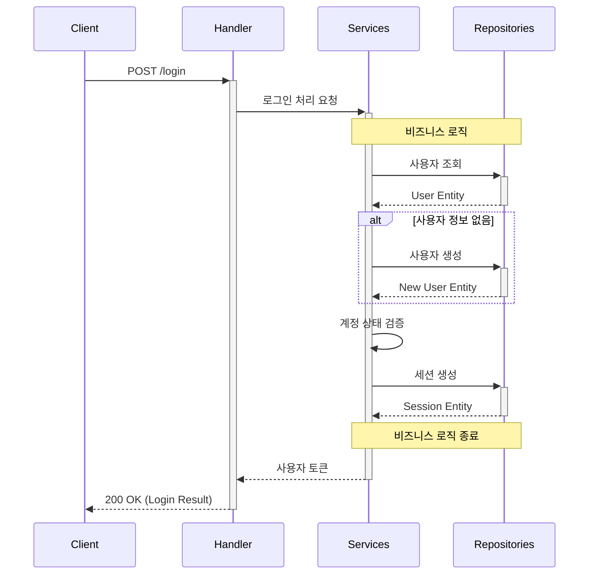

# 로그인/인증

본 문서에서는 서버의 인증 흐름에 대해 설명합니다. 주요 내용은 다음과 같습니다.

## 1. 로그인 프로세스 (Login Flow)

클라이언트가 유저들의 로그인 요청을 보내면 서버는 다음 절차를 거쳐 인증을 수행합니다.

```mermaid
sequenceDiagram
    participant C as Client
    participant H as Handler
    participant S as Services
    participant R as Repositories
    
    C->>+H: POST /login
    H->>+S: 로그인 처리 요청
    
    %% 비즈니스 로직 시작을 알리는 노트
    note over S, R: 비즈니스 로직
    
    S->>+R: 사용자 조회
    R-->>-S: User Entity
    
    alt 사용자 정보 없음
        S->>+R: 사용자 생성
        R-->>-S: New User Entity
    end
    S->>S: 계정 상태 검증
    S->>+R: 세션 생성
    R-->>-S: Session Entity
    %% 비즈니스 로직 종료를 알리는 노트
    note over S, R: 비즈니스 로직 종료
    
    S-->>-H: 사용자 토큰
    H-->>-C: 200 OK (Login Result)
```
