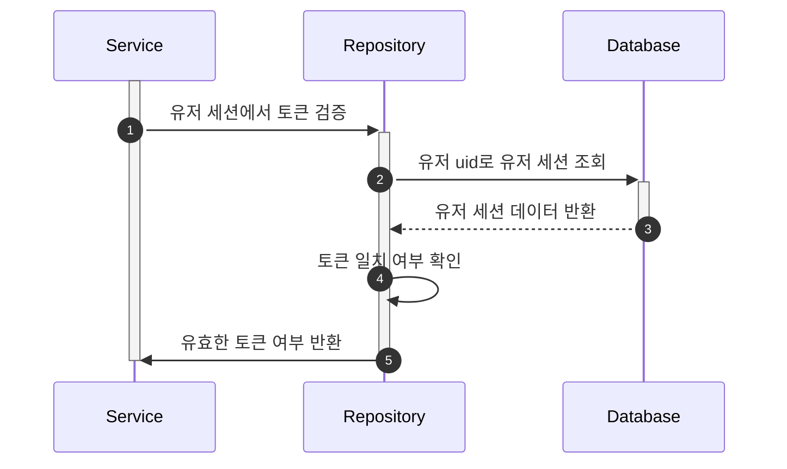
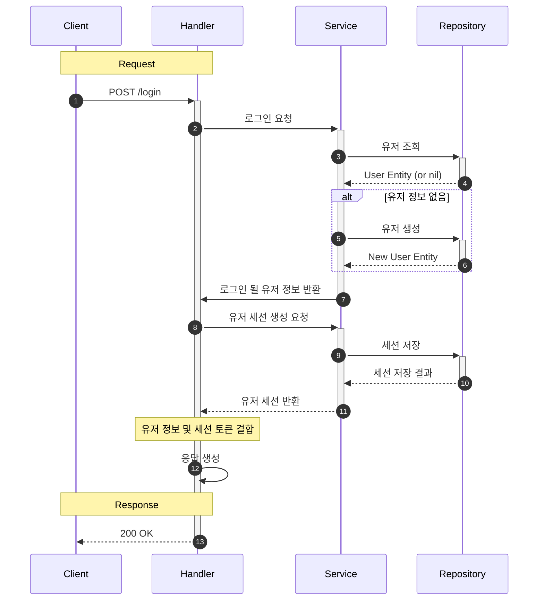

# 로그인/인증

본 문서에서는 서버의 인증 흐름에 대해 설명합니다. 주요 내용은 다음과 같습니다.

## 목차

- [1. 유저 토큰 인증 (User Token Authentication)](#1-유저-토큰-인증)
- [2. 로그인 (Login Flow)](#2-로그인-login-flow)

## 1. 유저 토큰 인증 (Authenticate Flow)

유저 세션의 토큰을 검증하는 흐름은 다음과 같습니다.

## 2. 로그인 (Login Flow)

클라이언트가 유저들의 로그인 요청을 보내면 서버는 다음 절차를 거쳐 인증을 수행합니다.

