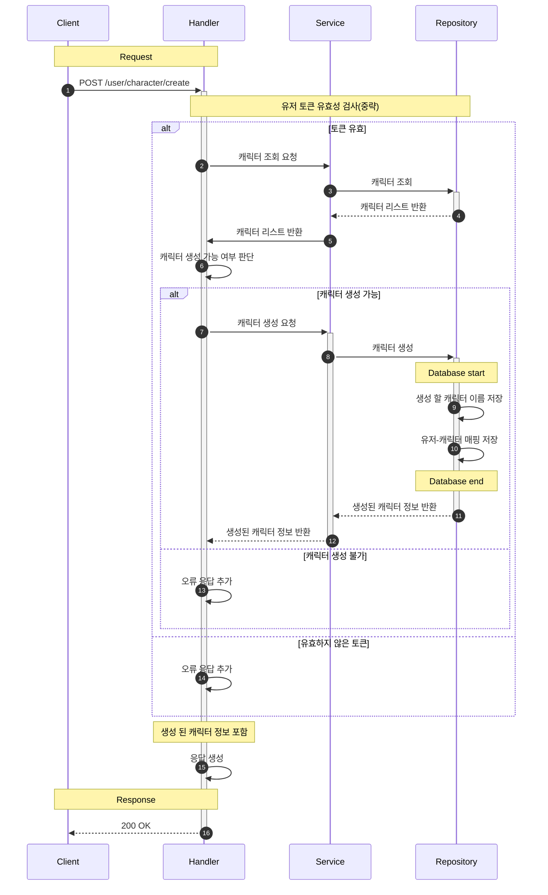
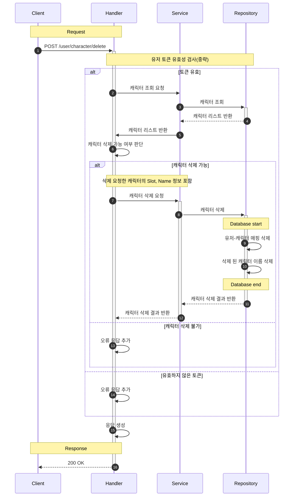

# 유저/캐릭터 관리

본 문서에서는 유저의 캐릭터 관리와 관련된 흐름을 설명합니다.

## 목차

- [1. 캐릭터 생성 (Create Character Flow)](#1-캐릭터-생성-create-character-flow)
- [2. 캐릭터 제거 (Delete Character Flow)](#2-캐릭터-제거-delete-character-flow)

## 1. 캐릭터 생성 (Create Character Flow)

## 2. 캐릭터 삭제 (Delete Character Flow)

